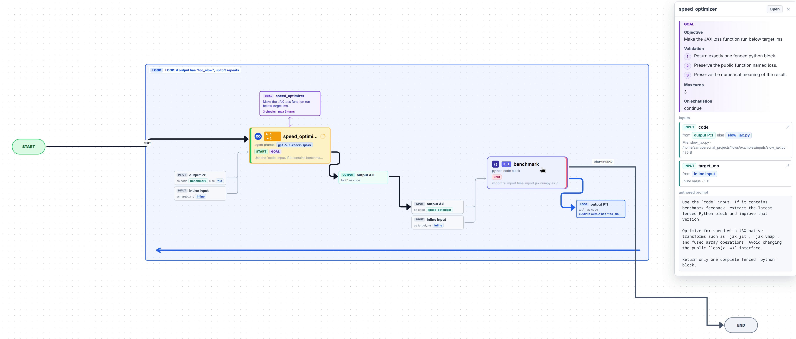

# Flows

Markdown-native agent workflows: write prompts, code blocks, inputs, outputs,
goals, and loops in one `.md` file, then run or visualize the flow. Inspired by
Ralph-style persistent agent loops, especially
[Ralph Orchestrator](https://github.com/mikeyobrien/ralph-orchestrator).



## What It Does

- Prompt blocks handle fuzzy work such as rewriting, review, planning, and summarizing.
- Code blocks handle deterministic work such as parsing, tests, validation, and benchmarks.
- Inputs and outputs are explicit, so later blocks only receive what the flow declares.
- Loops are ordinary start rules, driven by code output such as `fast_enough` or `too_slow`.
- Goal cards attach human-readable objectives and validation criteria to a single agent block.

## Quick Start

```bash
make build-go
./flow validate examples/jax_short_goal_loop.md
./flow chart examples/jax_short_goal_loop.md
```

Run the short JAX optimization demo:

```bash
python3 -m venv .venv
.venv/bin/python -m pip install "jax[cpu]"

FLOW_PYTHON_COMMAND=.venv/bin/python ./flow run examples/jax_short_goal_loop.md -f \
  --input code=@examples/inputs/slow_jax.py \
  --input target_ms=5
```

## Flow Shape

Each `##` heading is one block. The first fenced `yaml` block configures inputs,
start conditions, executor, model, and routing. Prompt text or an executable
code fence supplies the block body.

````markdown
## speed_optimizer

```yaml
inputs:
  code:
    from: external
start:
  - always: {max_runs: 1}
  - when: benchmark
    contains: too_slow
    max_runs: 3
prompt_executor: codex_cli
model: gpt-5.3-codex-spark
```

Rewrite the input code to reduce runtime. Return only the improved code.
````

## CLI

```bash
./flow validate <flow.md>
./flow run <flow.md> -f --input name=value --input file=@path/to/file
./flow chart <flow.md>
./flow viz <flow.md>
```
