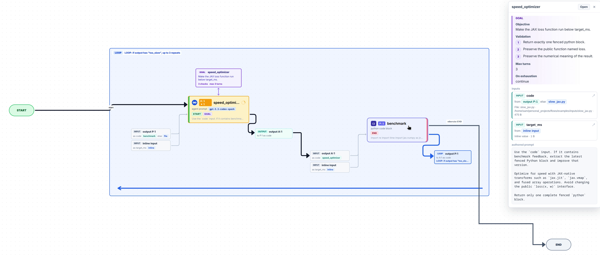

# Flows

Markdown-native agent workflows: write prompts, code blocks, inputs, outputs,
goals, and loops in one `.md` file, then run or visualize the flow.

Inspired by https://github.com/snarktank/ralph.



## What It Does

- Prompt blocks handle fuzzy work such as rewriting, review, planning, and summarizing.
- Code blocks handle deterministic work such as parsing, tests, validation, and benchmarks.
- Inputs and outputs are explicit, so later blocks only receive what the flow declares.
- Loops are ordinary start rules, driven by code output such as `fast_enough` or `too_slow`.
- Goal cards attach human-readable objectives and validation criteria to a single agent block.

## Quick Start

```bash
make build-go
./flow validate examples/jax_short_goal_loop.md
./flow chart examples/jax_short_goal_loop.md
```

Run the short JAX optimization demo:

```bash
python3 -m venv .venv
.venv/bin/python -m pip install "jax[cpu]"

FLOW_PYTHON_COMMAND=.venv/bin/python ./flow run examples/jax_short_goal_loop.md -f \
  --input code=@examples/inputs/slow_jax.py \
  --input target_ms=5
```

See [the one-loop JAX demo](docs/jax-one-loop-demo.md) for a complete walkthrough.

## Flow Shape

Each `##` heading is one block. The first fenced `yaml` block configures inputs,
start conditions, executor, model, and routing. Prompt text or an executable
code fence supplies the block body.

````markdown
## speed_optimizer

```yaml
inputs:
  code:
    from: external
start:
  - always: {max_runs: 1}
  - when: benchmark
    contains: too_slow
    max_runs: 3
prompt_executor: codex_cli
model: gpt-5.3-codex-spark
```

Rewrite the input code to reduce runtime. Return only the improved code.
````

## CLI

Human-oriented commands remain the default:

```bash
./flow validate <flow.md>
./flow run <flow.md> -f --input name=value --input file=@path/to/file
./flow chart <flow.md>
./flow viz <flow.md>
```

Use `--no-editor` for an attached headless text run. Without `-f`, text mode
still starts a background process and reports its log path.

```bash
./flow run <flow.md> -f --no-editor --input name=value
```

### Machine interface

Machine results use `schema_version: 1`. JSON modes write only JSON to stdout;
normal structured failures are returned in that same stream rather than as
prose on stderr.

Validate a file or generated source from stdin:

```bash
./flow validate flow.md --json
./flow validate - --json < flow.md
```

Inspect the parsed graph, including ordered blocks, content, inputs, start
conditions, goals, overrides, and explicit dependency edges:

```bash
./flow inspect flow.md --json
./flow inspect - --json < flow.md
```

The single-document validation shape is:

```json
{
  "schema_version": 1,
  "command": "validate",
  "ok": true,
  "flow": {
    "source": "flow.md",
    "name": "Example",
    "description": "An example flow",
    "external_inputs": ["code"],
    "block_count": 2,
    "defaults": {"prompt_executor": "codex_cli", "model": "gpt-5.3-codex-spark", "temperature": 0.2}
  }
}
```

Dry-run or execute once and receive one final JSON document. These modes imply
foreground execution and `--no-editor`; they never create a detached run.

```bash
./flow run flow.md --dry-run --json --input code=@candidate.py
./flow run flow.md --json --input code=@candidate.py
./flow run flow.md --json --output results --input code=@candidate.py
```

For long runs, stream one versioned event per line. Events include
`run_started`, `block_started`, `block_finished`, optional `execution_error`,
and a terminal `run_finished` containing every final output in flow source
order.

```bash
./flow run flow.md --jsonl --input code=@candidate.py
```

Supply multiline external inputs as a JSON object. Values must be strings;
repeatable `--input` flags are applied afterward and override the same JSON
keys.

```bash
./flow run flow.md --json --inputs-json inputs.json
printf '%s' '{"code":"line one\nline two"}' | \
  ./flow run flow.md --json --inputs-json -
./flow run flow.md --json --inputs-json inputs.json --input target_ms=5
```

`-` can own stdin for either the flow source or `--inputs-json`, but not both
in one invocation. `flow viz -` also accepts flow source from stdin, and
`flow viz flow.md --json` wraps the Mermaid text in the versioned result.

Structured errors have a stable code and message, with parse/validation
diagnostics where applicable:

```json
{
  "schema_version": 1,
  "command": "validate",
  "ok": false,
  "error": {
    "code": "invalid_flow",
    "message": "validation failed for flow.md",
    "diagnostics": [
      {"phase": "validation", "source": "flow.md", "block": "review", "field": "start", "message": "at least one start condition required"}
    ]
  }
}
```

Exit status is `0` for success, `2` for invalid arguments/flow/input, `3` for
an execution failure, and `1` for an unexpected internal failure. `--json`
and `--jsonl` are mutually exclusive.
